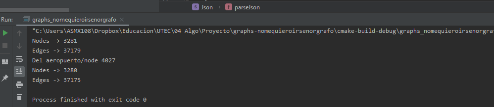

## Dependencies
- Cmake 3.1+
- g++

## Compilation
```bash
make
```

## Execution
```bash
make run
```

## Data
All json files are placed inside data. This is symlinked to the build folder so you can access it as "data/filename.json" from code

## Graph
Se usa la librería JSON for Modern c++ para leer los json. 

